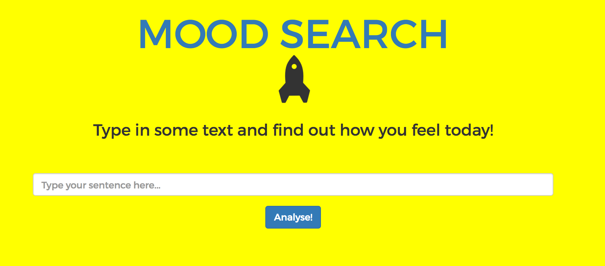
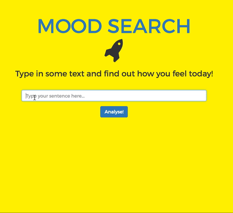
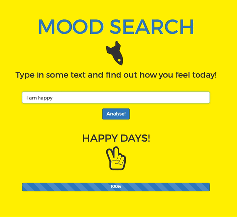
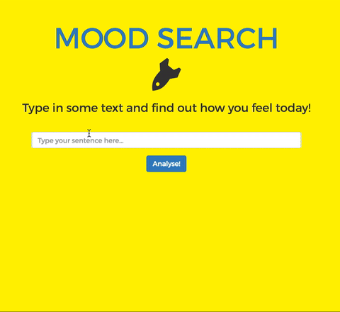
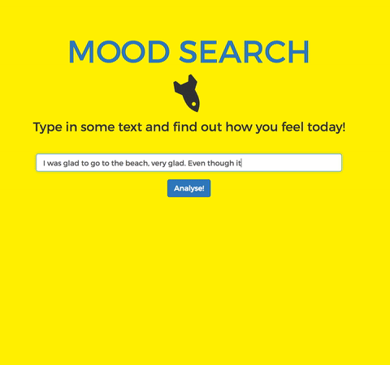
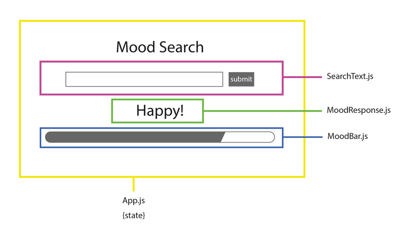

Mood Search
=====================

<div style="text-align:center;"></div>

#### Specifications

- The web app should accept text input and classify it as **happy**, **sad** or **unknown**, based on a set of keywords.
- The list of keywords must be fetched from the server (no database).
- Text is happy if it includes at least 50% more happy words than sad words. It is sad if it contains at least 50% more sad words than happy words. Otherwise it is unknown.
- The web app should calculate how happy or sad the text is on a scale.
- Each mention of a word should be counted separately.
- Engaging and colourful for kids.
- Suitable for both mobile and desktop devices.  

**Evaluates to Happy**<div style="text-align:center;"></div>

**Evaluates to Unknown**<div style="text-align:center;"></div>

**Evaluates to Sad**<div style="text-align:center;"></div>

**Calculates sadness or happiness on a scale**<div style="text-align:center;"></div>


### How to run Mood Search locally

```
$ git clone git@github.com:nenoch/mood-search.git
$ cd mood-search
$ npm start

// open http://localhost:3000/ in the browser

```

### Approach

I started with a mockup of the interface to identify the different components, their responsibilities and hierarchy.

<div style="text-align:center;"></div>

So the state lives in App.js as main parent, that then passes data as props to all other underlying components. For this reason I also added here the Lifecycle function ```componentDidMount()``` to get keywords from the server at soon as App.js is mounted in the page. In this same component the logic analysing the content of the input is triggered on submit.

I gave functions and components expressive names corresponding to specifications and with a clear separation of concerns.

I introduced Bootstrap for responsiveness, ready-to-use style for forms and buttons, and for its React components. FontAwesome icons instead, helped making the app playful with images reflecting what is happening on the screen. I wanted to add animation so, at first, I wanted to introduce [animate.css](https://daneden.github.io/animate.css/) but then I realised I could implement simple animations already with Bootstrap and FontAwesome. It wouldn't have added much to the specifications.

_Note: I paid special attention to write clear bullet points commits throughout the whole development._

**Reflections**

This is my first React App and I have to say that I really enjoyed building it, even though I am still a bit skeptical about putting logic in the interface. I had not enough time to both learn React and add appropriate Jest+Enzyme tests for documentation, but I will definitely do it them later on.

### Built on

* [react-hot-boilerplate](https://github.com/gaearon/react-hot-boilerplate.git)

### Technologies

* React
* Webpack
* Node.js
* HTML5/CSS
* Bootstrap
* FontAwesome

### Dependencies

* [webpack-dev-server](https://github.com/webpack/webpack-dev-server)
* [babel-loader](https://github.com/babel/babel-loader)
* [react-hot-loader](https://github.com/gaearon/react-hot-loader)
* [axios](https://github.com/mzabriskie/axios)
* [react-bootstrap](https://react-bootstrap.github.io/)
* [react-fontawesome](https://github.com/danawoodman/react-fontawesome)
* [style-loader](https://github.com/webpack-contrib/style-loader)
* [css-loader](https://github.com/webpack-contrib/css-loader)
